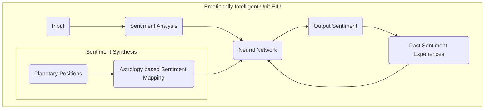

# Emotionally Intelligent Machines(EIM's) & Sentiment Synthesis based on Vedic Astrology
> Author: Mohit Singh  
> College: College of Computing Sciences & Information Technology  
> University: Teerthanker Mahaveer University Moradabad  
> DOI:

## Abstract
This paper describes that how Emotionally Intelligent Machines(EIM's) can be developed by using the concept of Ancient Vedic Astrology.

## Keywords
> Neural Networks, Sentimental Analysis, Vedic Astrology, Synthesis, Emotional Intelligence, Affective Computing, Subconsious, Cognitive Science, Philosophy, Psychology, Modalities, Galvanic Resistance, Bioinformatics

## 1. Introduction

## 2. Literature Review

| S.No | Author | Publisher | Year | Paper |
|:----:|:------:|:---------:|:----:|:-----:|
|  01  | Paulo Martins | Scholars Journal of Arts, Humanities and Social Sciences | 2023 | [A Concise History of Hindu Astrology and Indian Spirituality](https://www.researchgate.net/publication/368608597_A_Concise_History_of_Hindu_Astrology_and_Indian_Spirituality) |
|  02  | Paul Clements | Goldsmiths College, University of London, London, UK | 2022 | [Astrology, modernity and the project of self-identity](https://www.tandfonline.com/doi/epdf/10.1080/14755610.2022.2093234?needAccess=true&role=button) |
|  03  | Nhan Cach Dang, María N. Moreno-García & Fernando De la Prieta | PapersWithCode | 2020 | [Sentiment Analysis Based on Deep Learning: A Comparative Study](https://arxiv.org/pdf/2006.03541v1.pdf) |
|  04  | Guangyi Zhang, Vandad Davoodnia, & Ali Etemad, Senior Member, IEEE | PapersWithCode | 2022 | [PARSE: Pairwise Alignment of Representations in Semi-Supervised EEG Learning for Emotion Recognition](https://arxiv.org/pdf/2202.05400v2.pdf) |
|  05  | Hao Zhou, Minlie Huang, Tianyang Zhang, Xiaoyan Zhu & Bing Liu | PapersWithCode | 2017 | [Emotional Chatting Machine: Emotional Conversation Generation with Internal and External Memory](https://arxiv.org/pdf/1704.01074v4.pdf) |
|  06  | Hye-Rin Kim, Yeong-Seok Kim, Seon Joo Kim & In-Kwon Lee | PapersWithCode | 2017 | [Building Emotional Machines: Recognizing Image Emotions through Deep Neural Networks](https://arxiv.org/abs/1705.07543v2) |
|  07  | Yu-Hung Tsai, Sheng-Kuang Wu, Shyr-Shen Yu & Meng-Hsiun Tsai | MDPI Journal Mathematics | 2023 | [A Novel Hybrid Deep Neural Network for Predicting Athlete Performance Using Dynamic Brain Waves](https://www.researchgate.net/publication/368437916_A_Novel_Hybrid_Deep_Neural_Network_for_Predicting_Athlete_Performance_Using_Dynamic_Brain_Waves) |
|  08  | Yossi Buskila, Alba Bellot-Saez & John W. Morley | Research Gate | 2019 | [Generating Brain Waves, the Power of Astrocytes](https://www.researchgate.net/publication/336657756_Generating_Brain_Waves_the_Power_of_Astrocytes) |
|  09  | Noushin Hajarolasvadi, Miguel Arjona Ramírez & Hasan Demirel | arxiv | 2020 | [Generative Adversarial Networks in Human Emotion Synthesis:A Review](https://arxiv.org/abs/2010.15075) |
|  10  | Partha Sarathi Paul | SpringerLink | 2021 | [Application of Big Data and Machine Learning for Astrological Predictions](https://link.springer.com/chapter/10.1007/978-981-16-2543-5_1) |
|  11  | Vanderson Esperidião-Antonio, Marilia Majeski-Colombo, Diana Toledo-Monteverde, Glaciele Moraes-Martins, Juliana José Fernandes, Marjorie Bauchiglioni de Assis, Stefânia Montenegro & Rodrigo Siqueira-Batista | International Review of Psychiatry | 2017 | [Neurobiology of emotions: an update](https://www.tandfonline.com/doi/full/10.1080/09540261.2017.1285983) |
|  12  | Sahiti S. Magapu & Sashank Vaddiparty | International Journal of Innovative Science and Research Technology | 2019 | [The Study of Emotional Intelligence in Artificial Intelligence](https://www.google.com/url?sa=t&source=web&rct=j&url=https://ijisrt.com/wp-content/uploads/2019/02/IJISRT19JA351.pdf&ved=2ahUKEwjQ3rf8sKn9AhWA6jgGHf1uCRgQFnoECBEQAQ&usg=AOvVaw14LIEFBptEDmRJ-LSdXkpN) |
|  13  | Raksha Sharma, Arpan Somani, Lakshya Kumar & Pushpak Bhattacharyya | IIT Bombay, India | 2017 | [Sentiment Intensity Ranking among Adjectives Using Sentiment Bearing Word Embeddings](https://aclanthology.org/D17-1058.pdf) |
|  14  | Felix Hamborg & Karsten Donnay |  | 2021 | [NewsMTSC: A Dataset for (Multi-)Target-dependent Sentiment Classification in Political News Articles](https://aclanthology.org/2021.eacl-main.142.pdf) |
|  15  | Raja M L Maravan Lakshmana Reddi | Research Gate | 2022 | [Description of Twelve Zodiac Signs in Ancient Indian Texts](https://www.researchgate.net/publication/359710805_Description_of_Twelve_Zodiac_Signs_in_Ancient_Indian_Texts) |
|  16  | Priya, Shreya Sureka & Dr. Divya Jain | International Journal of Scientific Research in Science, Engineering and Technology | 2021 | [The Potentials of Subconscious Mind](https://www.researchgate.net/publication/349718138_The_Potentials_of_Subconscious_Mind) |
|  17  | Krishanu Kumar Das |  | 2021 | [Consciousness:AndItsRelation With SubconsciousMind](https://osf.io/hnvba) |
|  18  | Luxiang Zhang & Jialing Yuan |  | 2021 | [The Effect of Subconscious on Life and Ethical Behavior](https://www.atlantis-press.com/article/125966956.pdf) |
|  19  | Prem Kamble |  | 2021 | [What is Subconscious Mind? How Does it Impact our Behaviour?](https://papers.ssrn.com/sol3/papers.cfm?abstract_id=3806525) |
|  20  | Ralf C. Staudemeyer & Eric Rothstein Morris |  | 2019 | [Understanding LSTM -- a tutorial into Long Short-Term Memory Recurrent Neural Networks](https://arxiv.org/pdf/1909.09586.pdf) |
|  21  | Zhaoyang Niu, Guoqiang Zhong, Guohua Yue, Li-Na Wang, Hui Yu, Xiao Ling & Junyu Dong |  | 2023 | [Recurrent attention unit: A new gated recurrent unit for long-term memory of important parts in sequential data](https://www.sciencedirect.com/science/article/abs/pii/S0925231222013339) |
|  22  | Alexandr A. Ezhov |  | 2018 | [Neural Network Model of Unconscious](https://link.springer.com/chapter/10.1007/978-3-319-92537-0_3) |
|  23  | Tong Zhao, Yiqian Zhu, Hailiang Tang, Rong Xie, Jianhong Zhu, & John H. Zhang |  | 2019 | [Consciousness: New Concepts and Neural Networks](https://www.ncbi.nlm.nih.gov/pmc/articles/PMC6629860/) |
|  24  | Eugene Piletsky |  | 2019 | [Consciousness and Unconsciousness of Artificial Intelligence](https://www.researchgate.net/publication/332215462_Consciousness_and_Unconsciousness_of_Artificial_Intelligence) |
|  25  | Ian Osband, Yotam Doron, Matteo Hessel, John Aslanides, Eren Sezener, Andre Saraiva, Katrina McKinney, Tor Lattimore, Csaba Szepesvari, Satinder Singh, Benjamin Van Roy, Richard Sutton, David Silver & Hado Van Hasselt |  | 2020 | [Behaviour Suite for Reinforcement Learning](https://openreview.net/pdf?id=rygf-kSYwH) |
|  26  | Ahmad Hammoudeh |  | 2018 | [A Concise Introduction to Reinforcement Learning](https://www.researchgate.net/publication/323178749_A_Concise_Introduction_to_Reinforcement_Learning) |
|  27  | Ruiqi Chen, Yanquan Zhou, Liujie Zhang & Xiuyu Duan |  | 2019 | [Word-level sentiment analysis with reinforcement learning](https://iopscience.iop.org/article/10.1088/1757-899X/490/6/062063/pdf) |
|  28  | Rui Liu, Berrak Sisman & Haizhou Li |  | 2021 | [Reinforcement Learning for Emotional Text-to-Speech Synthesis with Improved Emotion Discriminability](https://www.isca-speech.org/archive/pdfs/interspeech_2021/liu21p_interspeech.pdf) |
|  29  | Arvind Kumar, Rajiv Singh & Ram Chandra | International Journal of Science and Research (IJSR) | 2017 | [Emotional Intelligence for Artificial Intelligence: A Review](https://www.google.com/url?sa=t&source=web&rct=j&url=https://www.ijsr.net/archive/v7i8/ART2019481.pdf&ved=2ahUKEwjQ3rf8sKn9AhWA6jgGHf1uCRgQFnoECDgQAQ&usg=AOvVaw1L1baoZdnjX-cwpxbNbCde) |
|  30  | Himanshu Kumar & A. Martin | Science Direct | 2016 | [Artificial Emotional Intelligence: Conventional and deep learning approach](https://www.sciencedirect.com/science/article/abs/pii/S0957417422016931) |
|  31  | P. Lee & D. Gurnkl | International Journal of Artificial Intelligence | 2015 | [Why Truly Intelligent Machines Need Emotions](https://www.researchgate.net/publication/281890143_Why_Truly_Intelligent_Machines_Need_Emotions) |
|  32  | Irene Daum & Hans Markowitsch |  | 2009 | [Neurobiological Basis of Emotions](https://www.researchgate.net/publication/226394023_Neurobiological_Basis_of_Emotions) |
|  33  | Too Many | NATIONAL SCIENTIFIC COUNCIL ON THE DEVELOPING CHILD | 2004 | [Children’s Emotional Development Is Built into the Architecture of Their Brains](https://developingchild.harvard.edu/wp-content/uploads/2004/04/Childrens-Emotional-Development-Is-Built-into-the-Architecture-of-Their-Brains.pdf) |
|  34  | Rosalind W Picard | Research Gate | 2004 | [Toward Machines With Emotional Intelligence](https://www.researchgate.net/publication/221645343_Toward_Machines_With_Emotional_Intelligence) |
|  35  | Zeljko AGIC & Danijela MERKLER |  | 2012 | [Rule-Based Sentiment Analysis in Narrow Domain: Detecting Sentiment in Daily Horoscopes Using Sentiscope](https://aclanthology.org/W12-5312.pdf) |
|  36  | Philippe Zarka | International Astronomical Union 2011 | 2011 | [Astronomy and Astrology](https://www.cambridge.org/core/services/aop-cambridge-core/content/view/3171E9B009B4E8421B1913AC0A08AB32/S1743921311002602a.pdf/astronomy-and-astrology.pdf) |
|  37  | Rosalind W. Picard
 | MIT Media Laboratory |  | [Towards Machines with Emotional Intelligence](https://www.google.com/url?sa=t&source=web&rct=j&url=https://affect.media.mit.edu/pdfs/07.picard-EI-chapter.pdf&ved=2ahUKEwiNnKT00639AhWU2DgGHUK6B_AQFnoECBAQAQ&usg=AOvVaw1F5T-XqiBRbl57TJyib1Vr) |
|  38  |  |  |  |  |
|  39  |  |  |  |  |
|  40  |  |  |  |  |

## 3. Methedology

Basic Architecture of Emotionally Intelligent Unit(EIU):-

## 4. Implementation

## 5. Conclusion

## References
- [Brihat Parashar Hora Shastra by Pt. Ganesh Datt Pathak](https://archive.org/details/BrihatParasharHoraShastraGaneshDattPathak)
- [Vedic Astrology](https://www.vedic-astrology.net/)
- [A Concise History of Hindu Astrology and Indian Spirituality](https://www.researchgate.net/publication/368608597_A_Concise_History_of_Hindu_Astrology_and_Indian_Spirituality)
- [Astrology](https://en.wikipedia.org/wiki/Astrology)
- [Astrology and Science](https://en.wikipedia.org/wiki/Astrology_and_science)
- [Barnum Effect](https://en.wikipedia.org/wiki/Barnum_effect)
- [Consciousness](https://en.wikipedia.org/wiki/Consciousness)
- [Subconscious](https://en.wikipedia.org/wiki/Subconscious)
- [Unconscious Mind](https://en.wikipedia.org/wiki/Unconscious_mind)
- [The Power Of Your Subconscious Mind (Joseph Murphy)](https://archive.org/details/the-power-of-your-subconscious-mind-joseph-murphy)
- [Artificial Consciousness](https://en.wikipedia.org/wiki/Artificial_consciousness)
- [Neural Oscillations(Brain Waves)](https://en.wikipedia.org/wiki/Neural_oscillation)
- [Behavioral Neuroscience](https://en.wikipedia.org/wiki/Behavioral_neuroscience)
- [Emotion](https://en.wikipedia.org/wiki/Emotion)
- [Affective Neuroscience](https://en.wikipedia.org/wiki/Affective_neuroscience)
- [Belief Systems](https://en.wikipedia.org/wiki/Belief)
- [Mathematical Psychology](https://en.wikipedia.org/wiki/Mathematical_psychology)
- [Understanding the neuroscience behind emotional intelligence](https://www.forbes.com/sites/forbescoachescouncil/2020/04/22/understanding-the-neuroscience-behind-emotional-intelligence/)
- [Sentiment Analysis](https://en.wikipedia.org/wiki/Sentiment_analysis)
- [Affective Computing](https://en.wikipedia.org/wiki/Affective_computing)
- [Reinforcement Learning](https://en.wikipedia.org/wiki/Reinforcement_learning)
- [Reinforcement Learning for Emotional Text-to-Speech Synthesis with Improved Emotion Discriminability](https://ttslr.github.io/i-ETTS/)
- [Perceptron(P)](https://en.wikipedia.org/wiki/Perceptron)
- [Artificial Neural Networks(ANN's)](https://en.wikipedia.org/wiki/Artificial_neural_network)
- [Biological Neural Networks(BNN's)](https://en.wikipedia.org/wiki/Biological_neural_network)
- [Convolutional Neural Networks(CNN's)](https://en.wikipedia.org/wiki/Convolutional_neural_network)
- [Feed Forward(FF)](https://en.wikipedia.org/wiki/Feedforward_neural_networks)
- [Radial Basis Networks(RBN's)](https://en.wikipedia.org/wiki/Radial_basis_function_network)
- [Deep Feed Forward(DFF)]()
- [Recurrent Neural Networks(RNN's)](https://en.wikipedia.org/wiki/Recurrent_neural_networks)
- [Long / Short Term Memory(LSTM)](https://en.wikipedia.org/wiki/Long_short-term_memory)
- [Gated Recurrent Unit(GRU)](https://en.wikipedia.org/wiki/Gated_recurrent_unit)
- [Auto Encoder(AE)](https://en.wikipedia.org/wiki/Autoencoder)
- [Variational Auto Encoder(VAE)](https://en.wikipedia.org/wiki/Variational_autoencoder)
- [Denoising Auto Encoder(DAE)]()
- [Sparse Auto Encoder(SAE)]()
- [Markov Chain(MC)](https://en.wikipedia.org/wiki/Markov_chain)
- [Hopfield Network(HN)](https://en.wikipedia.org/wiki/Hopfield_network)
- [Boltzmann Machine(BM)](https://en.wikipedia.org/wiki/Boltzmann_machine)
- [Restricted Boltzmann Machine(RBM)](https://en.wikipedia.org/wiki/Restricted_Boltzmann_machine)
- [Deep Belief Network(DBN)](https://en.wikipedia.org/wiki/Deep_belief_network)
- [Deep Convolutional Network(DCN)](https://en.wikipedia.org/wiki/Convolutional_deep_belief_network)
- [Deconvolutional Network(DN)]()
- [Deep Convolutional Inverse Graphics Network(DCIGN)]()
- [Generative Adverserial Network(GAN)](https://en.wikipedia.org/wiki/Generative_adversarial_network)
- [Liquid State Machine(LSM)](https://en.wikipedia.org/wiki/Liquid_state_machine)
- [Extreme Learning Machine(ELM)](https://en.wikipedia.org/wiki/Extreme_learning_machine)
- [Echo State Network(ESN)](https://en.wikipedia.org/wiki/Echo_state_network)
- [Deep Residual Network(DRN)](https://en.wikipedia.org/wiki/Residual_neural_network)
- [Kohonen Network(KN)]()
- [Support Vector Machine(SVM)](https://en.wikipedia.org/wiki/Support_vector_machine)
- [Neural Turing Machine(NTM)](https://en.wikipedia.org/wiki/Neural_Turing_Machine)
- [Bidirectional Encoder Representations from Transformers(BERT)](https://en.wikipedia.org/wiki/BERT_(Language_model))
- [Generative Pre-Trained Tranformer-3(GPT-3)](https://en.wikipedia.org/wiki/GPT-3)
