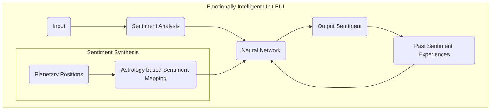

# **Emotionally Intelligent Machines(EIM's) & Sentiment Synthesis based on Ancient Vedic Astrology**
> Author: Mohit Singh  
> College: College of Computing Sciences & Information Technology  
> University: Teerthanker Mahaveer University Moradabad  
> DOI:

## Abstract
In this paper, we will discuss about the Emotionally Intelligent Machines(EIM's) which is the new field of research in Artificial Intelligence but it has a great potential to do immense good, however the technology can be misused but it is up to the consumers of this technology who will decide whether the technology will be used for good or for evil. This paper describes that how Emotionally Intelligent Machines(EIM's) & Sentiment Synthesis Systems can be developed by using the concept of Ancient Vedic Astrology.

## Keywords
> Neural Networks, Sentimental Analysis, Vedic Astrology, Synthesis, Emotional Intelligence, Affective Computing, Subconsious, Cognitive Science, Philosophy, Psychology, Modalities, Galvanic Resistance, Bioinformatics, The Gateway Experience, Hemi-Sync, Cognitive Dissonance, Cognitive Harmony, Astral Travel, Hypnosis, Trasedental Meditation, BioFeedback(Creative Visualization), Emotion Dynamics

# 1. Introduction
## Importance of EIM's in Modern Technical World
Emotionally Intelligent Machines(EIM's) is the development of systems that can recognize, interpret, process, and simulate human emotions based on the concept of ancient vedic astrology. They are the machines which can adapt different situations and knows how to handle these situations more intelligently. The applications of EIM's are numerous and expanding rapidly. Some of the common applications of EIM's are:
* Human-Computer Interaction(HCI): EIM's is extremely helpful in HCI, as it enables computers to understand and respond to human emotions, making the interaction more natural, intuitive, and empathetic. Here are some ways in which EIM's can be useful in developing machine ethics and morality:
  * Understanding Human Emotions: EIM's can help machines to understand human emotions, which is an important component of ethical decision-making. For example, a machine that can detect when a human is experiencing fear or pain could adjust its behavior accordingly to avoid causing harm.
  * Ethical Decision-Making: EIM's can help machines to make more ethical decisions by taking into account human emotions and responses. For example, a self-driving car that can detect when a passenger is feeling anxious or stressed could adjust its driving style to provide a safer and more comfortable ride.
  * Morality and Empathy: EIM's can help machines to exhibit more empathy towards humans, which is an important component of moral decision-making. For example, a robot that can detect when a human is feeling sad or lonely could provide comfort or companionship.
  * Human-Machine Collaboration: EIM's can help facilitate collaboration between humans and machines by allowing machines to understand and respond to human emotions. This could lead to more effective and productive collaborations, as well as greater trust between humans and machines.
* Customer Service:
  * EIM's is used in customer service to understand customers' emotions and respond accordingly, improving customer satisfaction.
  * Customer Reviews, Feedbacks & Syrveys.
* Healthcare:
  * EIM's is used in healthcare to detect patient's emotions and provide appropriate treatment and care.
  * Treatment of Psychic Pateints.
  * Counsiling for persons suffering form depression & anxiety or even having suicidal tendency.
* Education:
  * EIM's is used in education to improve the effectiveness of teaching by understanding the emotional state of the students and adapting the teaching method accordingly.
* Marketing:
  * EIM's is used in marketing to analyze customer's emotions and tailor marketing messages to maximize their impact.
* Entertainment:
  * EIM's is used in the entertainment industry to create more immersive experiences for users by understanding their emotional responses.
  * EIM's is used in gaming to create more engaging games that respond to the player's emotions also create the dynamic gaming environment accordingly.
  * EIM's is can be also used to create environments and writing scripts in movies industry.
* Arts:
  * Artistic content generation such as Melodies & Progressions in Music, Paintings & Poetry.
* Development of Machine Ethics & Computational Morality: EIM's can be useful in developing machine ethics and morality by allowing machines to understand and respond to human emotions, which is an important component of ethical and moral decision-making.
* Human Resources: EIM's is used in human resources to analyze employee's emotions and improve the work environment and productivity.
* Social Media: EIM's is used in social media to analyze user's emotions and provide more personalized content.
* Business Intelligence: EIM's are more intelligent than the traditional machines as a result they can help in Business Decision Making.

Overall, EIM's can play an important role in developing machine ethics and morality by allowing machines to understand and respond to human emotions, which is an important component of ethical and moral decision-making. This could help ensure that machines act in accordance with human values and contribute to a more ethical and moral society. They have the potential to improve the way we interact with technology and create more empathetic and personalized experiences.

## Human Mind, Vedic Astrology & Dynamical Systems

Human mind is one of the most important part of the entire human body which contains thoughts, imagination, memory, will power & sensation. Every human being has it's own personality. Some have similar personalities, some have not. The individual's mindset is responsible for it's own personality and behaviour. Human mind is classified majorly into three categories. Conscious, subconscious & unconscious mind. All the events around us which we are experiencing currently which is also known as the "awareness", comes due to the conscious mind, all of our habits and routines which are formed due to the repetition processes of our feelings, experiences and task handling and completion are stored in the subconscious. The third type of category of mind is the most mysterious and powerful which is the unconscious mind. It operates beyond our conscious awareness. It is the part of our mind which contains thoughts, memories and emotions that we are not aware of, but that still influence our behaviour and feelings drastically. Conscious mind contains some short term memory in a very less amount. The content stored inside this type of mind can be changed easily. Subconscious mind has more long term memory than the conscious mind. It can store thoughts longer than the conscious mind which are difficult to change and involves practicing something continuously, developing habits by doing continous efforts, etc in order to change the mindset. The unconscious mind has permanent memory which can't be changed by any type of effort. It is the primary source of the human behaviour and personality. It is just like the default personality of any particular human being.

Emotion Dynamics, melody progression example, comedy jokes example, momentum

In this presentation, Mr. Jon Miles explores the ways in which differential equations for physical energy transfer can be applied to modeling emotion dynamics, with a view toward application in health-care. Improving one's emotional well-being is based on reducing emotional impedance, and understanding how emotion flows through circuits can help in reducing the blockages to flow.

Astrology is like the snapshot of our unconscious mind.

Dynamical systems theory is oftenly used to study the relationship between the human mind and behaviour. As we know that the systems are classified mojorly into two categroies which are static systems and dynamic systems. The systems whose present output is only dependent on the input of the same time(present time) are known as the static systems or memoryless systems whereas the systems whose present output depends upon the present input as well as also on the past and/or the future input are termed as the dynamical systems. A dynamical system always must have memory with it. The human mind is a very complex dynamical system that evolves over time in responses to the various inputs from the environment. To understand this in simple words, let's imagine what will happen if human mind does not have any type of memory with it or it will act as a static system. What will be our experience in this case? How does it feel like? If it will be the case, then everything will be instantaneous for us. There is no happieness, no sadness no fear & no anger. There will be no emotions. There will be no experience of feeling anything due to the absence of memory. This will happen because our mind collects all the past experiences of our life as data in the memory and whenever will be a situation to deal, it extracts the information of the past experiences stored inside the memory, compares this information with the present input, and decides how to handle with and react in this situation. This task handling experience is stored again in the memory for the future processing.

## How Vedic Astrology Effects Human Mind?

In dynamical systems theory, there is a very important term which is known as the initial condition of the system. In general, initial conditions are the values of the variables at the starting time of the simulation or experiment, and they are needed to solve the reccurence relation(difference equations) in discrete-time domain and differential equations in continuous-time domain to obtain the solution. In analogy with vedic astrology, the horoscope chart or the birth chart of an individual exactly works just like the initial condition of the emotional dynamical system of that individual.

## The Gateway Experience, Neural Oscillations(Brain Waves) & Vedic Astrology

According to Robert Allan Monroe, Instead of supressing the left hemisphere, as is done in Hypnosis, or largely bypassing and ignoring it, as it done in Transedental Meditaion, BioFeedback teaches the left hemisphere first to visualize the desired result, and then to recognize the feeling associated with the experience of successful right hemisphere access to the specific lower cerebral cortex. Pain or pleasure or other areas, in the manner needed to produce the desired result.

Overpowering logical vs emotional mind.  
Saturn(Shani Dev) vs Moon(Chandra Dev).  

# 2. Literature Review

| S.No | Author | Publisher | Year | Paper |
|:----:|:------:|:---------:|:----:|:-----:|
|  01  | Paulo Martins | Scholars Journal of Arts, Humanities and Social Sciences | 2023 | [A Concise History of Hindu Astrology and Indian Spirituality](https://www.researchgate.net/publication/368608597_A_Concise_History_of_Hindu_Astrology_and_Indian_Spirituality) |
|  02  | Paul Clements | Goldsmiths College, University of London, London, UK | 2022 | [Astrology, modernity and the project of self-identity](https://www.tandfonline.com/doi/epdf/10.1080/14755610.2022.2093234?needAccess=true&role=button) |
|  03  | Nhan Cach Dang, María N. Moreno-García & Fernando De la Prieta | PapersWithCode | 2020 | [Sentiment Analysis Based on Deep Learning: A Comparative Study](https://arxiv.org/pdf/2006.03541v1.pdf) |
|  04  | Guangyi Zhang, Vandad Davoodnia, & Ali Etemad, Senior Member, IEEE | PapersWithCode | 2022 | [PARSE: Pairwise Alignment of Representations in Semi-Supervised EEG Learning for Emotion Recognition](https://arxiv.org/pdf/2202.05400v2.pdf) |
|  05  | Hao Zhou, Minlie Huang, Tianyang Zhang, Xiaoyan Zhu & Bing Liu | PapersWithCode | 2017 | [Emotional Chatting Machine: Emotional Conversation Generation with Internal and External Memory](https://arxiv.org/pdf/1704.01074v4.pdf) |
|  06  | Hye-Rin Kim, Yeong-Seok Kim, Seon Joo Kim & In-Kwon Lee | PapersWithCode | 2017 | [Building Emotional Machines: Recognizing Image Emotions through Deep Neural Networks](https://arxiv.org/abs/1705.07543v2) |
|  07  | Yu-Hung Tsai, Sheng-Kuang Wu, Shyr-Shen Yu & Meng-Hsiun Tsai | MDPI Journal Mathematics | 2023 | [A Novel Hybrid Deep Neural Network for Predicting Athlete Performance Using Dynamic Brain Waves](https://www.researchgate.net/publication/368437916_A_Novel_Hybrid_Deep_Neural_Network_for_Predicting_Athlete_Performance_Using_Dynamic_Brain_Waves) |
|  08  | Yossi Buskila, Alba Bellot-Saez & John W. Morley | Research Gate | 2019 | [Generating Brain Waves, the Power of Astrocytes](https://www.researchgate.net/publication/336657756_Generating_Brain_Waves_the_Power_of_Astrocytes) |
|  09  | Noushin Hajarolasvadi, Miguel Arjona Ramírez & Hasan Demirel | arxiv | 2020 | [Generative Adversarial Networks in Human Emotion Synthesis:A Review](https://arxiv.org/abs/2010.15075) |
|  10  | Partha Sarathi Paul | SpringerLink | 2021 | [Application of Big Data and Machine Learning for Astrological Predictions](https://link.springer.com/chapter/10.1007/978-981-16-2543-5_1) |
|  11  | Vanderson Esperidião-Antonio, Marilia Majeski-Colombo, Diana Toledo-Monteverde, Glaciele Moraes-Martins, Juliana José Fernandes, Marjorie Bauchiglioni de Assis, Stefânia Montenegro & Rodrigo Siqueira-Batista | International Review of Psychiatry | 2017 | [Neurobiology of emotions: an update](https://www.tandfonline.com/doi/full/10.1080/09540261.2017.1285983) |
|  12  | Sahiti S. Magapu & Sashank Vaddiparty | International Journal of Innovative Science and Research Technology | 2019 | [The Study of Emotional Intelligence in Artificial Intelligence](https://www.google.com/url?sa=t&source=web&rct=j&url=https://ijisrt.com/wp-content/uploads/2019/02/IJISRT19JA351.pdf&ved=2ahUKEwjQ3rf8sKn9AhWA6jgGHf1uCRgQFnoECBEQAQ&usg=AOvVaw14LIEFBptEDmRJ-LSdXkpN) |
|  13  | Raksha Sharma, Arpan Somani, Lakshya Kumar & Pushpak Bhattacharyya | IIT Bombay, India | 2017 | [Sentiment Intensity Ranking among Adjectives Using Sentiment Bearing Word Embeddings](https://aclanthology.org/D17-1058.pdf) |
|  14  | Felix Hamborg & Karsten Donnay |  | 2021 | [NewsMTSC: A Dataset for (Multi-)Target-dependent Sentiment Classification in Political News Articles](https://aclanthology.org/2021.eacl-main.142.pdf) |
|  15  | Raja M L Maravan Lakshmana Reddi | Research Gate | 2022 | [Description of Twelve Zodiac Signs in Ancient Indian Texts](https://www.researchgate.net/publication/359710805_Description_of_Twelve_Zodiac_Signs_in_Ancient_Indian_Texts) |
|  16  | Priya, Shreya Sureka & Dr. Divya Jain | International Journal of Scientific Research in Science, Engineering and Technology | 2021 | [The Potentials of Subconscious Mind](https://www.researchgate.net/publication/349718138_The_Potentials_of_Subconscious_Mind) |
|  17  | Krishanu Kumar Das |  | 2021 | [Consciousness:AndItsRelation With SubconsciousMind](https://osf.io/hnvba) |
|  18  | Luxiang Zhang & Jialing Yuan |  | 2021 | [The Effect of Subconscious on Life and Ethical Behavior](https://www.atlantis-press.com/article/125966956.pdf) |
|  19  | Prem Kamble |  | 2021 | [What is Subconscious Mind? How Does it Impact our Behaviour?](https://papers.ssrn.com/sol3/papers.cfm?abstract_id=3806525) |
|  20  | Ralf C. Staudemeyer & Eric Rothstein Morris |  | 2019 | [Understanding LSTM -- a tutorial into Long Short-Term Memory Recurrent Neural Networks](https://arxiv.org/pdf/1909.09586.pdf) |
|  21  | Zhaoyang Niu, Guoqiang Zhong, Guohua Yue, Li-Na Wang, Hui Yu, Xiao Ling & Junyu Dong |  | 2023 | [Recurrent attention unit: A new gated recurrent unit for long-term memory of important parts in sequential data](https://www.sciencedirect.com/science/article/abs/pii/S0925231222013339) |
|  22  | Alexandr A. Ezhov |  | 2018 | [Neural Network Model of Unconscious](https://link.springer.com/chapter/10.1007/978-3-319-92537-0_3) |
|  23  | Tong Zhao, Yiqian Zhu, Hailiang Tang, Rong Xie, Jianhong Zhu, & John H. Zhang |  | 2019 | [Consciousness: New Concepts and Neural Networks](https://www.ncbi.nlm.nih.gov/pmc/articles/PMC6629860/) |
|  24  | Eugene Piletsky |  | 2019 | [Consciousness and Unconsciousness of Artificial Intelligence](https://www.researchgate.net/publication/332215462_Consciousness_and_Unconsciousness_of_Artificial_Intelligence) |
|  25  | Ian Osband, Yotam Doron, Matteo Hessel, John Aslanides, Eren Sezener, Andre Saraiva, Katrina McKinney, Tor Lattimore, Csaba Szepesvari, Satinder Singh, Benjamin Van Roy, Richard Sutton, David Silver & Hado Van Hasselt |  | 2020 | [Behaviour Suite for Reinforcement Learning](https://openreview.net/pdf?id=rygf-kSYwH) |
|  26  | Ahmad Hammoudeh |  | 2018 | [A Concise Introduction to Reinforcement Learning](https://www.researchgate.net/publication/323178749_A_Concise_Introduction_to_Reinforcement_Learning) |
|  27  | Ruiqi Chen, Yanquan Zhou, Liujie Zhang & Xiuyu Duan |  | 2019 | [Word-level sentiment analysis with reinforcement learning](https://iopscience.iop.org/article/10.1088/1757-899X/490/6/062063/pdf) |
|  28  | Rui Liu, Berrak Sisman & Haizhou Li |  | 2021 | [Reinforcement Learning for Emotional Text-to-Speech Synthesis with Improved Emotion Discriminability](https://www.isca-speech.org/archive/pdfs/interspeech_2021/liu21p_interspeech.pdf) |
|  29  | Arvind Kumar, Rajiv Singh & Ram Chandra | International Journal of Science and Research (IJSR) | 2017 | [Emotional Intelligence for Artificial Intelligence: A Review](https://www.google.com/url?sa=t&source=web&rct=j&url=https://www.ijsr.net/archive/v7i8/ART2019481.pdf&ved=2ahUKEwjQ3rf8sKn9AhWA6jgGHf1uCRgQFnoECDgQAQ&usg=AOvVaw1L1baoZdnjX-cwpxbNbCde) |
|  30  | Himanshu Kumar & A. Martin | Science Direct | 2016 | [Artificial Emotional Intelligence: Conventional and deep learning approach](https://www.sciencedirect.com/science/article/abs/pii/S0957417422016931) |
|  31  | P. Lee & D. Gurnkl | International Journal of Artificial Intelligence | 2015 | [Why Truly Intelligent Machines Need Emotions](https://www.researchgate.net/publication/281890143_Why_Truly_Intelligent_Machines_Need_Emotions) |
|  32  | Irene Daum & Hans Markowitsch |  | 2009 | [Neurobiological Basis of Emotions](https://www.researchgate.net/publication/226394023_Neurobiological_Basis_of_Emotions) |
|  33  | Too Many | NATIONAL SCIENTIFIC COUNCIL ON THE DEVELOPING CHILD | 2004 | [Children’s Emotional Development Is Built into the Architecture of Their Brains](https://developingchild.harvard.edu/wp-content/uploads/2004/04/Childrens-Emotional-Development-Is-Built-into-the-Architecture-of-Their-Brains.pdf) |
|  34  | Rosalind W Picard | Research Gate | 2004 | [Toward Machines With Emotional Intelligence](https://www.researchgate.net/publication/221645343_Toward_Machines_With_Emotional_Intelligence) |
|  35  | Zeljko AGIC & Danijela MERKLER |  | 2012 | [Rule-Based Sentiment Analysis in Narrow Domain: Detecting Sentiment in Daily Horoscopes Using Sentiscope](https://aclanthology.org/W12-5312.pdf) |
|  36  | Philippe Zarka | International Astronomical Union 2011 | 2011 | [Astronomy and Astrology](https://www.cambridge.org/core/services/aop-cambridge-core/content/view/3171E9B009B4E8421B1913AC0A08AB32/S1743921311002602a.pdf/astronomy-and-astrology.pdf) |
|  37  | Rosalind W. Picard | MIT Media Laboratory |  | [Towards Machines with Emotional Intelligence](https://www.google.com/url?sa=t&source=web&rct=j&url=https://affect.media.mit.edu/pdfs/07.picard-EI-chapter.pdf&ved=2ahUKEwiNnKT00639AhWU2DgGHUK6B_AQFnoECBAQAQ&usg=AOvVaw1F5T-XqiBRbl57TJyib1Vr) |
|  38  | Sahiti S. Magapu |  |  | [The Study of Emotional Intelligence in Artificial Intelligence](https://www.google.com/url?sa=t&source=web&rct=j&url=https://ijisrt.com/wp-content/uploads/2019/02/IJISRT19JA351.pdf&ved=2ahUKEwiNnKT00639AhWU2DgGHUK6B_AQFnoECBEQAQ&usg=AOvVaw14LIEFBptEDmRJ-LSdXkpN) |
|  39  |  |  |  | [Implementation of Emotional Intelligence in a machine](https://www.academia.edu/26823506/Implementation_of_Emotional_Intelligence_in_a_machine) |
|  40  |  |  | 1983 | [Analysis and Assesment of Gateway Process](https://www.cia.gov/readingroom/docs/CIA-RDP96-00788R001700210016-5.pdf) |
|  41  |  |  |  | [Emotional Intelligence Robotics to Motivate you Interaction in e-Learning: An Algorithm](https://www.google.com/url?sa=t&source=web&rct=j&url=https://syncedreview.com/2017/03/14/emotional-intelligence-is-the-future-of-artificial-intelligence/amp/&ved=2ahUKEwj31bGC1q39AhXnxjgGHXtqAks4KBAWegQIAhAB&usg=AOvVaw07gEnP_rLY5QBj8645i52q) |

# 3. Methodology

* Modelling of Emotion Dynamics
* Differential Equations of Emotions
* Laplace Transform
* CTFT
* Difference Equations of Emotions
* Z Transform
* DTFT
* DFT
* FFT

Basic Architecture of Emotionally Intelligent Unit(EIU):-

# 4. Implementation
Emoji Use

# 5. Conclusion

## References

## Bibliography
- [Brihat Parashar Hora Shastra by Pt. Ganesh Datt Pathak](https://archive.org/details/BrihatParasharHoraShastraGaneshDattPathak)
- [Journeys Out Of Body by Dr. Robert Allan Monroe](https://archive.org/details/journeys_out_body)
- [Vedic Astrology](https://www.vedic-astrology.net/)
- [A Concise History of Hindu Astrology and Indian Spirituality](https://www.researchgate.net/publication/368608597_A_Concise_History_of_Hindu_Astrology_and_Indian_Spirituality)
- [Astrology](https://en.wikipedia.org/wiki/Astrology)
- [Astrology and Science](https://en.wikipedia.org/wiki/Astrology_and_science)
- [Barnum Effect](https://en.wikipedia.org/wiki/Barnum_effect)
- [Consciousness](https://en.wikipedia.org/wiki/Consciousness)
- [Subconscious](https://en.wikipedia.org/wiki/Subconscious)
- [Unconscious Mind](https://en.wikipedia.org/wiki/Unconscious_mind)
- [The Power Of Your Subconscious Mind (Joseph Murphy)](https://archive.org/details/the-power-of-your-subconscious-mind-joseph-murphy)
- [Artificial Consciousness](https://en.wikipedia.org/wiki/Artificial_consciousness)
- [Analogy & Duality](http://milesresearch.com/pdf/Analogy-and-Duality.pdf)
- [Emotion Dynamics](http://milesresearch.com/pdf/Emotion-Dynamics.pdf)
- [Neural Oscillations(Brain Waves)](https://en.wikipedia.org/wiki/Neural_oscillation)
- [Behavioral Neuroscience](https://en.wikipedia.org/wiki/Behavioral_neuroscience)
- [Emotion](https://en.wikipedia.org/wiki/Emotion)
- [Affective Neuroscience](https://en.wikipedia.org/wiki/Affective_neuroscience)
- [Belief Systems](https://en.wikipedia.org/wiki/Belief)
- [Mathematical Psychology](https://en.wikipedia.org/wiki/Mathematical_psychology)
- [Understanding the neuroscience behind emotional intelligence](https://www.forbes.com/sites/forbescoachescouncil/2020/04/22/understanding-the-neuroscience-behind-emotional-intelligence/)
- [Sentiment Analysis](https://en.wikipedia.org/wiki/Sentiment_analysis)
- [Affective Computing](https://en.wikipedia.org/wiki/Affective_computing)
- [Reinforcement Learning](https://en.wikipedia.org/wiki/Reinforcement_learning)
- [Reinforcement Learning for Emotional Text-to-Speech Synthesis with Improved Emotion Discriminability](https://ttslr.github.io/i-ETTS/)
- [Perceptron(P)](https://en.wikipedia.org/wiki/Perceptron)
- [Artificial Neural Networks(ANN's)](https://en.wikipedia.org/wiki/Artificial_neural_network)
- [Biological Neural Networks(BNN's)](https://en.wikipedia.org/wiki/Biological_neural_network)
- [Convolutional Neural Networks(CNN's)](https://en.wikipedia.org/wiki/Convolutional_neural_network)
- [Feed Forward(FF)](https://en.wikipedia.org/wiki/Feedforward_neural_networks)
- [Radial Basis Networks(RBN's)](https://en.wikipedia.org/wiki/Radial_basis_function_network)
- [Deep Feed Forward(DFF)]()
- [Recurrent Neural Networks(RNN's)](https://en.wikipedia.org/wiki/Recurrent_neural_networks)
- [Long / Short Term Memory(LSTM)](https://en.wikipedia.org/wiki/Long_short-term_memory)
- [Gated Recurrent Unit(GRU)](https://en.wikipedia.org/wiki/Gated_recurrent_unit)
- [Auto Encoder(AE)](https://en.wikipedia.org/wiki/Autoencoder)
- [Variational Auto Encoder(VAE)](https://en.wikipedia.org/wiki/Variational_autoencoder)
- [Denoising Auto Encoder(DAE)]()
- [Sparse Auto Encoder(SAE)]()
- [Markov Chain(MC)](https://en.wikipedia.org/wiki/Markov_chain)
- [Hopfield Network(HN)](https://en.wikipedia.org/wiki/Hopfield_network)
- [Boltzmann Machine(BM)](https://en.wikipedia.org/wiki/Boltzmann_machine)
- [Restricted Boltzmann Machine(RBM)](https://en.wikipedia.org/wiki/Restricted_Boltzmann_machine)
- [Deep Belief Network(DBN)](https://en.wikipedia.org/wiki/Deep_belief_network)
- [Deep Convolutional Network(DCN)](https://en.wikipedia.org/wiki/Convolutional_deep_belief_network)
- [Deconvolutional Network(DN)]()
- [Deep Convolutional Inverse Graphics Network(DCIGN)]()
- [Generative Adverserial Network(GAN)](https://en.wikipedia.org/wiki/Generative_adversarial_network)
- [Liquid State Machine(LSM)](https://en.wikipedia.org/wiki/Liquid_state_machine)
- [Extreme Learning Machine(ELM)](https://en.wikipedia.org/wiki/Extreme_learning_machine)
- [Echo State Network(ESN)](https://en.wikipedia.org/wiki/Echo_state_network)
- [Deep Residual Network(DRN)](https://en.wikipedia.org/wiki/Residual_neural_network)
- [Kohonen Network(KN)]()
- [Support Vector Machine(SVM)](https://en.wikipedia.org/wiki/Support_vector_machine)
- [Neural Turing Machine(NTM)](https://en.wikipedia.org/wiki/Neural_Turing_Machine)
- [Bidirectional Encoder Representations from Transformers(BERT)](https://en.wikipedia.org/wiki/BERT_(Language_model))
- [Generative Pre-Trained Tranformer-3(GPT-3)](https://en.wikipedia.org/wiki/GPT-3)
